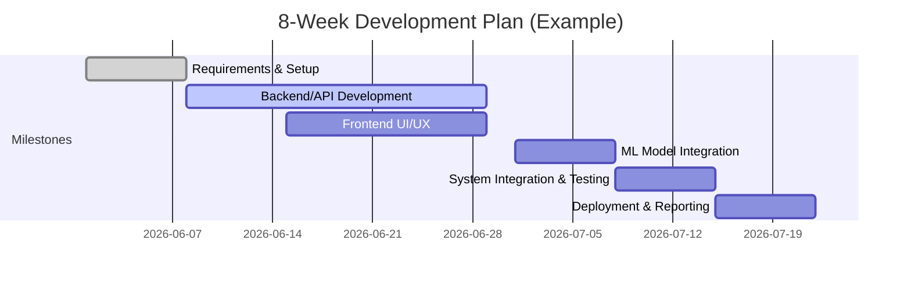
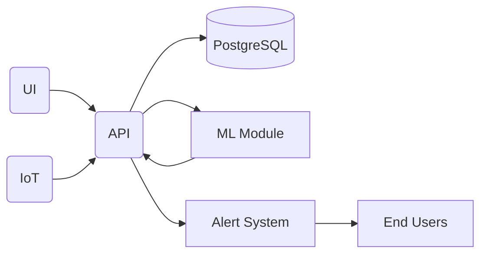

# Executive Summary  
To help an MCA team deliver high-impact semester projects aligned with the UN SDGs and placement goals, we identified **7 novel ideas** that combine social benefit with in-demand tech skills. Each project targets a different SDG, solves a concrete local problem, and uses free data/APIs and open-source tools. The recommended projects are summarized below (and in the table), and each description includes problem statement, features, tech stack, data sources, hardware, effort (COCOMO), key skills, novelty, and a mini‐to‐major roadmap. These projects emphasize full-stack development, cloud deployment, data/ML, IoT/mobile, and DevOps practices, matching top hiring trends. 

| SDG  | Project Title                            | Cost (₹)   | Effort (pw) | Top Skills                     |
|-----:|------------------------------------------|-----------:|------------:|-------------------------------|
| 2    | **Smart Agri Advisor**                   | ₹2,500     | 16          | IoT, ML, Full-stack, Cloud     |
| 3    | **Telehealth AI Chatbot**                | ₹500       | 12          | NLP/AI, Web Dev, Security      |
| 4    | **Rural Education Chatbot**              | ₹500       | 12          | NLP/ML, Mobile/Web Dev         |
| 6    | **Water Quality Monitoring System**      | ₹3,000     | 16          | IoT, DataViz, Full-stack       |
| 7    | **Solar Forecast & Energy Manager**      | ₹500       | 12          | ML, Full-stack, Cloud          |
| 11   | **Green Commute Route Planner**          | ₹500       | 14          | GIS, ML, Full-stack, Mobile    |
| 12   | **Repair & Recycle Marketplace**         | ₹500       | 10          | Mobile/Web Dev, Database       |
| 15   | **Forest/Deforestation Monitor**         | ₹500       | 14          | ML/GIS, Web Dev                |

Each project can be built in a single semester (6–10 weeks) by two students, using free tiers of cloud platforms and open data. They serve as strong foundations for major projects (scaling to IoT networks, mobile apps, advanced AI, etc.) and showcase sought-after technologies in interviews. A sample 8-week timeline (above) illustrates development phases.  

---

## SDG 2 – **Smart Agriculture Advisor**  
**Problem:** Smallholder farmers lack precise guidance on irrigation, fertilization, and crop choice, leading to low yields and wasted resources. This project provides an AI-driven advisory system to optimize farming decisions.  

- **Core Features:** IoT soil sensors (moisture/temperature) or public weather APIs, a dashboard with farm health and moisture maps, irrigation/fertilizer scheduling recommendations, yield prediction using ML (regression on weather/historical data), and alerts (e.g. drought risk).  
- **Tech Stack:** Frontend with React, Backend with Python (Flask/FastAPI) or Java (Spring Boot), database PostgreSQL (or MongoDB for flexibility), ML in Python (Pandas, Scikit-learn or TensorFlow), cloud hosting on AWS/Azure/GCP (using free tier), DevOps with Docker and GitHub Actions.  
- **Data Sources/APIs:** Weather data (OpenWeatherMap or NASA POWER for solar/precipitation), open crop-yield datasets (e.g. Kaggle’s India crop yield data), government agricultural statistics (e.g. data.gov.in), IoT sensor data.  
- **Hardware:** Optional: 1–2 low-cost soil moisture + temperature sensors (e.g. DHT22 + moisture module) connected to an ESP32 or Arduino. Enclosure for a demo prototype. Otherwise mock sensor values via API or CSV to save cost.  
- **Effort (COCOMO):** ~4–6 KLOC (simple backend + ML + frontend) ≈ 6–8 person-weeks for a 2-member team (Organic mode).  
- **Placement Skills:** IoT prototyping, REST APIs, full-stack development, Python/R integration for ML, Docker, cloud deployment (AWS or Azure), Agile teamwork.  
- **Novelty:** Integrates real-time IoT data with AI for small-scale precision agriculture (few free solutions exist for Indian farm needs).  
- **Roadmap (Mini→Major):**  
  1. **(Mini)** Build core: single-farm dashboard, API to ingest weather/sensor data, basic ML forecasts.  
  2. **(Mid)** Expand to multi-farm support, mobile app for field access, and more crops/languages.  
  3. **(Major)** Add remote sensing (NDVI via Google Earth Engine), drone imagery, demand-supply marketplace, and farm-to-market blockchain traceability.

## SDG 3 – **Telehealth AI Chatbot**  
**Problem:** Rural and underserved patients face poor access to medical advice. This project creates a secure AI-powered symptom-checker and patient portal to improve basic care access.  

- **Core Features:** Patient registration/login; symptom-input chat interface using NLP (to triage common ailments, recommend care or book appointments); integration with public health databases; scheduling video/audio calls with doctors; secure storage of patient records (encrypted); automatic email/SMS alerts for reminders. Emphasize data privacy (HIPAA/GDPR-like security).  
- **Tech Stack:** Frontend in React (or React Native for mobile), Backend in Node.js (Express) or Django (Python), Database PostgreSQL, ML/NLP with Python (transformers or spaCy), secure JWT auth, TLS/HTTPS, possibly chat UI framework (Botpress or Rasa). Cloud-host on AWS (Lambda or EC2) and database on AWS RDS/Azure. DevOps with Docker, Nginx, Git.  
- **Data Sources/APIs:** WHO symptom data (e.g. ICD or OpenEMR); health guideline APIs; public medical knowledge bases; optional: integration with eSanjeevani API (India’s telemedicine). OpenAI/GPT-type models for NLP (assuming free/minor usage or open models to stay low-cost).  
- **Hardware:** None required (mobile/web app only). For demonstration, use personal smartphone or PC.  
- **Effort (COCOMO):** ~3–4 KLOC (webapp + basic NLP) ≈ 5–7 person-weeks. Telemedicine in India is booming (market CAGR ~23%).  
- **Placement Skills:** Full-stack web development, RESTful services, NLP/AI model integration, data security practices, cloud/Azure or AWS, DevOps (CI/CD).  
- **Novelty:** A locally-relevant triage chatbot for underserved areas, beyond generic symptom checker apps – tailored to local diseases/languages and compliance with Indian digital health IDs.  
- **Roadmap (Mini→Major):**  
  1. **(Mini)** Develop web portal with chat-based symptom input and rule-based guidance; basic auth and record storage.  
  2. **(Mid)** Integrate ML for NLP (e.g. fine-tune BERT on medical Q&A), add teleconsultation scheduling, SMS reminders.  
  3. **(Major)** Deploy nationwide via cloud, partner with clinics, add voice-bot support and integration with government health APIs (eSanjeevani, ABHA), and predictive analytics for outbreaks.

## SDG 4 – **Rural Education Chatbot**  
**Problem:** Students in remote areas lack access to tutors and educational resources in local languages. This project builds an AI tutor chatbot that answers curriculum questions and provides learning quizzes offline.  

- **Core Features:** Chat interface (mobile/web) for Q&A tutoring in subjects (Math, Science, Languages), multilingual support (e.g. English + regional language), explanatory answers with examples, quiz generation, progress tracking, offline mode with downloaded content. Personalized learning paths.  
- **Tech Stack:** Frontend mobile app (React Native) or web (React.js), Backend Node.js or Django, Database (PostgreSQL or SQLite for offline), NLP/ML: use open LLM (e.g. BLOOM, Indic-Transformers) or open Chatbot framework (Rasa). Cloud backend (AWS/Azure) to sync content; use Git for code, Docker.  
- **Data Sources/APIs:** Public domain textbooks (NCERT PDFs), Wikipedia or CK12 content for Q&A, OpenAI GPT or BLOOM for answer generation (with caching), translation APIs (LibreTranslate).  
- **Hardware:** None needed (runs on phone or tablet). Offline-first design critical.  
- **Effort (COCOMO):** ~3 KLOC ≈ 4–6 person-weeks. Integrating open LLMs and multilingual support is the main challenge.  
- **Placement Skills:** NLP/ML, React/React Native, mobile-responsive design, data modeling, local data storage, Git.  
- **Novelty:** Combines AI tutoring with offline capability for rural students, which is still rare in Indian contexts.  
- **Roadmap (Mini→Major):**  
  1. **(Mini)** Basic English chatbot for one subject using rule-based Q&A (or small GPT model), deployed as web app.  
  2. **(Mid)** Add additional subjects, regional language support, and offline caching of answers.  
  3. **(Major)** Expand curriculum breadth, incorporate voice interface, teacher dashboard for monitoring, and ML analytics on learning outcomes.

## SDG 6 – **Smart Water Quality Monitoring System**  
**Problem:** Many communities lack real-time information on drinking water safety (pollutants, turbidity, pathogens). This project implements an end-to-end water quality sensor network with alerts.  

- **Core Features:** Low-cost IoT sensors to measure pH, turbidity, dissolved solids (or use government data for demo), streaming data to cloud; live dashboard showing water quality on map; historical trend charts; alert engine (email/SMS) for unsafe levels; predictive alerts (ML) for likely contamination (e.g. upstream pollution events). Possibly incorporate satellite rainfall data to predict runoff events.  
- **Tech Stack:** IoT firmware on ESP32 (C/C++ or MicroPython), Backend (Node.js or Python FastAPI) to receive sensor data via MQTT/HTTP, Database: time-series (InfluxDB/Timescale) or PostgreSQL, Frontend: React + Chart.js, Map (Leaflet/Mapbox). ML: Python (Pandas, Scikit-Learn) for anomaly/pollution prediction. Cloud platform (AWS IoT or Google Cloud IoT Core + AWS RDS/GCP SQL).  
- **Data Sources/APIs:** USGS/EPA Water Quality Portal for historic data, India Central Water Commission API (if available), NOAA rainfall API, OpenWeather for precipitation, Satellite (Sentinel) via Copernicus.  
- **Hardware:** Sensor kit (~₹2,500–3,000) including pH sensor, turbidity sensor, DHT22 (temp/humidity), and one ESP32. Waterproof enclosure and battery. Could start with one sensor prototype.  
- **Effort (COCOMO):** ~4–5 KLOC (firmware + server + UI) ≈ 8–10 person-weeks.  
- **Placement Skills:** Embedded C/Python, IoT data ingestion, time-series data handling, full-stack dev (React + API), data visualization, machine learning.  
- **Novelty:** Few open-source systems integrate real-time water sensors with analytics and alerts; empowers villages/schools to monitor water (aligns with SDG6 emphasis on water quality).  
- **Roadmap (Mini→Major):**  
  1. **(Mini)** Deploy one sensor station feeding to cloud API; build dashboard with map and threshold alerts.  
  2. **(Mid)** Add more sensors at different locations, add ML to forecast contamination (e.g. after heavy rain).  
  3. **(Major)** Integrate public data (EPA/other sources), mobile alert app for residents, automatic pump/shutoff control when unsafe, and collaborate with local water authorities.

## SDG 7 – **Solar Energy Forecast & Manager**  
**Problem:** Homeowners and microgrids need to predict solar generation and optimize consumption for renewable energy use. This system forecasts solar PV output and advises usage.  

- **Core Features:** Collect solar PV generation (simulated or real), weather (irradiance, temperature) and power usage data; ML model to predict next-day solar output; dashboard showing real-time vs predicted output; suggestions like “run dishwasher now” vs peak sun; battery charge/discharge schedule. Can also calculate carbon saved.  
- **Tech Stack:** Backend in Python (Flask/FastAPI) serving APIs; ML with Scikit-learn or TensorFlow; Frontend React + D3.js charts; DB: PostgreSQL or SQLite. Use NASA POWER API (free) for historical solar/weather data, along with local weather API. DevOps on AWS/GCP.  
- **Data Sources/APIs:** NASA POWER data (solar radiation, temperature); Indian Meteorological Dept (IMD) open data (if available); National Solar Radiation Database; Home energy usage (simulate or use public loads).  
- **Hardware:** Optional: a home energy monitor (e.g. Open Energy Monitor) to read PV output and consumption. For MVP, simulate data in software.  
- **Effort (COCOMO):** ~3 KLOC ≈ 6–8 person-weeks.  
- **Placement Skills:** Time-series prediction, data science, Python/Flask, React, AWS, DevOps.  
- **Novelty:** While commercial solar planners exist, a student project using open data for microgrid/home PV management is rare and useful for sustainability.  
- **Roadmap (Mini→Major):**  
  1. **(Mini)** Build historical solar data downloader (NASA POWER), train regression model, basic UI graphs.  
  2. **(Mid)** Add live IoT sensor inputs, battery/storage modeling, mobile notifications for power recommendations.  
  3. **(Major)** Integrate with local solar installers, add energy trading simulation (selling back to grid), and a community solar-sharing platform.

## SDG 11 – **Green Commute Route Planner** (SDG 11 & 13)  
**Problem:** City commuters unknowingly pick polluted or high-emission routes. A “green” route planner helps citizens choose paths that minimize exposure and emissions.  

- **Core Features:** Given source/destination, the app suggests routes that trade off time vs air quality and carbon footprint. It incorporates live traffic, pollution hotspots, and transit options. Features: multi-modal (walking/biking vs driving), CO₂/NO₂ estimates per route, and maps overlay of city pollution heatmap. Optional carpool or bike-sharing suggestions.  
- **Tech Stack:** Frontend: React (web) or React Native (mobile), Map libraries (Leaflet or Google Maps API). Backend: Spring Boot (Java) or Node.js for geoprocessing and APIs. Database: PostGIS-enabled Postgres for geoqueries. ML: Python for route optimization (could use Dijkstra with custom weights for pollution). Use graph libraries or OSRM for routing. Deploy on Heroku/AWS.  
- **Data Sources/APIs:** Real-time traffic (Google Traffic API), public transit API (Moovit or city data), air quality data (OpenAQ or local sensors), emissions factors (average car CO₂). Leverage research like “Green Paths” for optimization.  
- **Data Source Links:** [OpenAQ](https://openaq.org/) (global AQ data), World Air Quality Index (WAQI), Google Maps Directions API (for routing), OpenStreetMap.  
- **Hardware:** None (pure software).  
- **Effort (COCOMO):** ~4–5 KLOC ≈ 8–10 person-weeks. Implementing map-based routing is moderate work.  
- **Placement Skills:** GIS/mapping, full-stack development, data integration (APIs), algorithmic optimization, React, Java/Python.  
- **Novelty:** Few apps in India offer pollution-aware routing. Leveraging open research (like the Green Paths planner) for an Indian context (e.g. Salem/Chennai) is unique and socially beneficial.  
- **Roadmap (Mini→Major):**  
  1. **(Mini)** Implement single-mode planner (e.g. walking routes) using OSM + pollution data (use simple weighted shortest-path from). Visualize routes on map.  
  2. **(Mid)** Add driving routes, traffic data, alternative modes; build combined index (time+pollution).  
  3. **(Major)** Develop mobile app, add real-time CO₂ savings calculation, EV charging station integration, and partnerships with transport agencies for smart-signaling (SDG13 co-benefit).

## SDG 12 – **Repair & Recycle Marketplace**  
**Problem:** Electronic waste is surging (India generates ~1.6M tonnes e-waste/year) while repair shops go unnoticed. This app connects users to local repair services to extend product life and reduce waste.  

- **Core Features:** Geo-based listing of local repair shops (electronics, appliances, clothes), with ratings and services offered. Users can book repair appointments or request quotes. Gamify repair by rewarding users for fixing items (e.g. “points” for saves). Educational section on right-to-repair and recycling points.  
- **Tech Stack:** Frontend: React or React Native. Backend: Node.js/Express or Django. Database: MongoDB or PostgreSQL for listings. Use Google Maps API for location. Cloud hosting (Heroku or AWS free tier). Continuous deployment via GitHub Actions.  
- **Data Sources/APIs:** Initial data can be crowdsourced; later integrate municipal open data on e-waste collection points. Recycling info from official sources (CPCB e-waste rules).  
- **Hardware:** None (mobile/web). Possibly use QR codes on repair station posters for outreach.  
- **Effort (COCOMO):** ~2–3 KLOC ≈ 4–6 person-weeks. Mostly CRUD app with maps.  
- **Placement Skills:** Mobile/web development, database design, REST API, cloud deployment, user authentication.  
- **Novelty:** A local “Yelp”-like solution focused solely on repair and reuse, encouraging circular economy (few such niche apps exist).  
- **Roadmap (Mini→Major):**  
  1. **(Mini)** Build core with user and shop profiles, search by proximity, booking feature.  
  2. **(Mid)** Add user review system, push notifications for deals (e.g. spare parts sales), and integration with parts vendors.  
  3. **(Major)** Expand categories (bicycles, furniture), integrate municipal e-waste pickup scheduling, and ML recommendations (“repair vs replace” guidance).

## SDG 15 – **Forest & Deforestation Monitor**  
**Problem:** Illegal logging and deforestation threaten biodiversity. This project uses satellite imagery to detect land-use changes and alert authorities/NGOs.  

- **Core Features:** Automated processing of periodic satellite images (e.g. Sentinel-2) to detect forest cover change. Dashboard shows maps of forests with “heatmap” of recent tree loss. Alerts (email/SMS) when deforestation is detected above threshold. Historical trend charts and summaries. Optionally, use drone image input for higher resolution.  
- **Tech Stack:** Backend in Python (Flask/Django) running geospatial analysis. Use Google Earth Engine (Python API) or OpenCV/TensorFlow for change detection. Database: PostGIS or simple blob for storing map layers. Frontend: React with map (Leaflet) overlays. Use Cloud (Google Earth Engine free for research, plus GCP hosting). DevOps with Docker.  
- **Data Sources/APIs:** Satellite imagery: Sentinel-2 (ESA) via Google Earth Engine; Global Forest Watch APIs; NASA/USGS land cover data. [India-specific forest cover data](https://fsi.nic.in/) (Forest Survey of India) for validation.  
- **Hardware:** None (cloud-based). Optionally a low-cost drone for demonstration (not required).  
- **Effort (COCOMO):** ~4 KLOC ≈ 8–10 person-weeks. Image analysis is complex but many libraries and GEE simplify it.  
- **Placement Skills:** Geospatial analysis, Python data pipelines, full-stack development, GIS databases, cloud computing.  
- **Novelty:** AI-based deforestation alert systems exist in research, but building an open-source, cloud-deployed version tailored for Indian forests would be pioneering.  
- **Roadmap (Mini→Major):**  
  1. **(Mini)** Use GEE to detect large deforested regions (e.g. segments >1 ha) and display on map.  
  2. **(Mid)** Improve ML to spot smaller clearings, integrate local context (e.g. known plantations) to reduce false alerts.  
  3. **(Major)** Add mobile/field app for rangers to upload photos, two-way communication with agencies, and extend to other ecosystems (wetlands, coastal forests).

---

## Summary of Projects  
The above projects span **SDG 2, 3, 4, 6, 7, 11, 12, 15**, each with clear social/environmental impact. They use trending technologies (full-stack Java/JavaScript, Python/ML, IoT, cloud, DevOps) that are **highly valued by employers**. All rely primarily on free data sources and open APIs (see each “Data Sources” above) to minimize cost – most can be built for **under ₹5,000** in hardware and hosting fees, as summarized. Each project idea is **extensible**: e.g. adding ML, mobile apps, or IoT networks to evolve into a major 4th-semester project.

Each section above outlines how to implement the project (features/tech) and how it **scales to a larger system**. For example, the Green Commute Planner builds on research like “Green Paths” and can grow to city-wide deployments, while the Telehealth Bot rides the expanding telemedicine trend. In sum, these SDG-aligned projects are **novel, socially meaningful, and resume-boosting**, integrating AI/ML, cloud, IoT, and full-stack skills in one package.